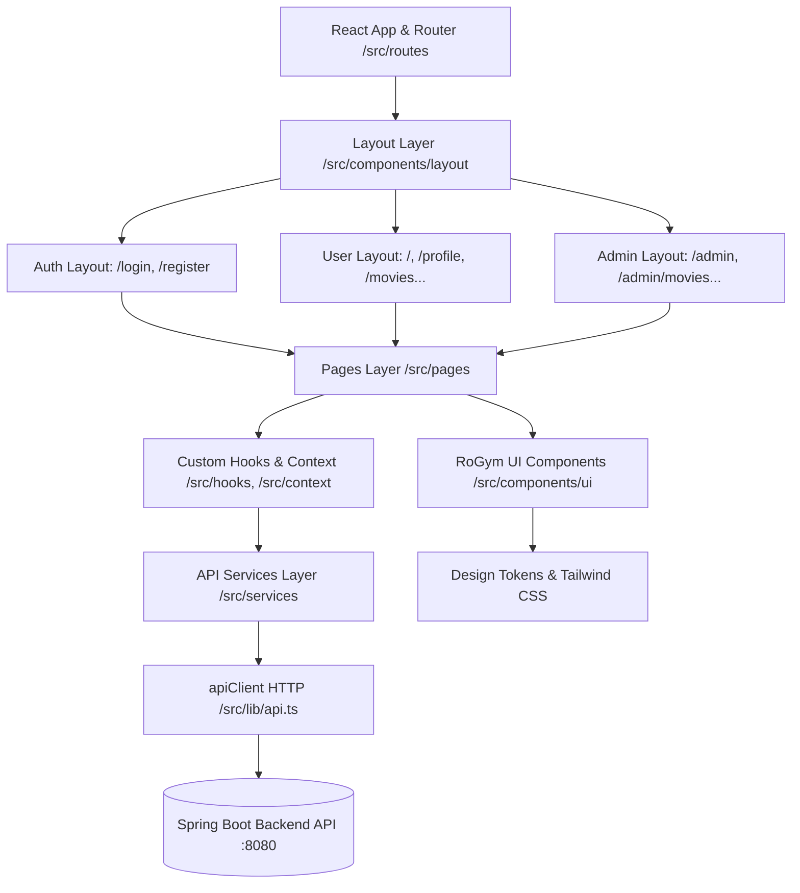
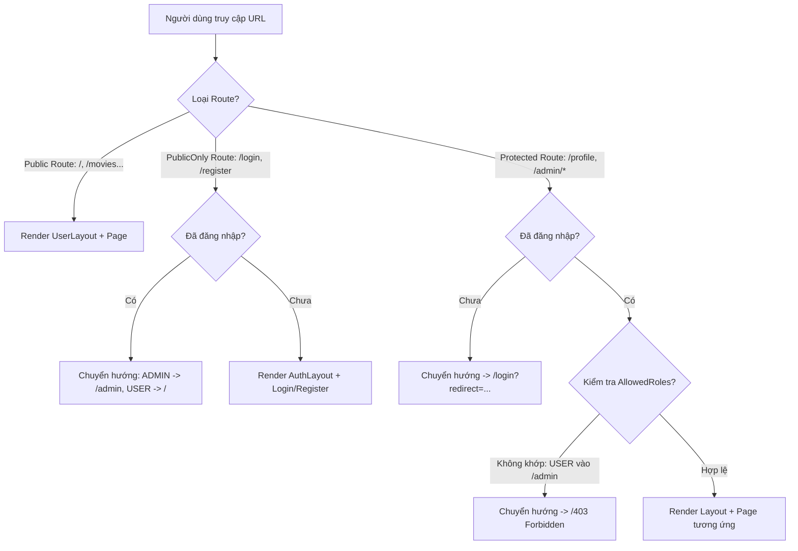

# 📘 Cẩm Nang Quy Chuẩn Thiết Kế & Phát Triển Frontend (Client Development Guidelines)

> **Dành cho tất cả Developer khi tham gia phát triển dự án Movie Ticket Booking - Nhóm 5 (Sun* Java NAITEI 26).**  
> Vui lòng đọc kỹ toàn bộ cẩm nang này trước khi bắt đầu tạo nhánh hoặc viết bất kỳ dòng mã nào.

---

## 📑 Mục Lục
1. [Tổng Quan Kiến Trúc & Sơ Đồ Phân Tầng](#1-tổng-quan-kiến-trúc--sơ-đồ-phân-tầng)
2. [Quy Tắc Vàng Khi Phát Triển Giao Diện (UI Kit)](#2-quy-tắc-vàng-khi-phát-triển-giao-diện-ui-kit)
3. [Bảng Tra Cứu 38+ RoGym UI Components](#3-bảng-tra-cứu-38-rogym-ui-components)
4. [Tầng Dịch Vụ API & Xử Lý Lỗi (API Services)](#4-tầng-dịch-vụ-api--xử-lý-lỗi-api-services)
5. [Phân Quyền & Hệ Thống Định Tuyến (Routing & RBAC)](#5-phân-quyền--hệ-thống-định-tuyến-routing--rbac)
6. [Hướng Dẫn Thực Hành Mẫu 1: Xây Dựng Trang Khách Hàng (User Page)](#6-hướng-dẫn-thực-hành-mẫu-1-xây-dựng-trang-khách-hàng-user-page)
7. [Hướng Dẫn Thực Hành Mẫu 2: Xây Dựng Trang Quản Trị (Admin Page)](#7-hướng-dẫn-thực-hành-mẫu-2-xây-dựng-trang-quản-trị-admin-page)
8. [Quy Chuẩn Viết Code (Coding Standards)](#8-quy-chuẩn-viết-code-coding-standards)
9. [Quy Ước Git Workflow & Quản Lý Task Redmine](#9-quy-ước-git-workflow--quản-lý-task-redmine)

---

## 1. Tổng Quan Kiến Trúc & Sơ Đồ Phân Tầng

Ứng dụng Frontend được thiết kế theo mô hình kiến trúc phân tầng rõ ràng (Layered Architecture), đảm bảo tính module hóa, dễ bảo trì và mở rộng:



### 📂 Trách nhiệm của từng thư mục trong `src/`:

| Thư mục | Trách nhiệm chính | Quy tắc bắt buộc |
| :--- | :--- | :--- |
| `src/types/` | Chứa các định nghĩa TypeScript interfaces, types cho DTOs, entity, payload. | Luôn tách file theo domain (`auth.ts`, `movie.ts`, `booking.ts`). Cấm dùng `any`. |
| `src/services/` | Chứa các hàm gọi API backend (`authService.ts`, `movieService.ts`). | Sử dụng `apiClient` / `api`, luôn khai báo kiểu dữ liệu trả về `Promise<T>`. |
| `src/context/` | Quản lý Global State (`AuthContext.tsx`). | Tách file định nghĩa context (`auth-context.ts`) để tương thích React Fast Refresh. |
| `src/hooks/` | Các React Custom Hooks (`useAuth.ts`, `useDebounce.ts`...). | Bắt đầu bằng tiền tố `use`, chỉ chứa logic không chứa JSX. |
| `src/components/ui/` | **38+ RoGym Base UI Components** (Button, Input, Card, Modal, Table...). | **Tuyệt đối không sửa trực tiếp** trừ khi cập nhật hệ thống chung. Tái sử dụng 100%. |
| `src/components/layout/` | Các Layouts bọc trang (`UserLayout.tsx`, `AdminLayout.tsx`, `AuthLayout.tsx`). | Chứa Header, Sidebar, Footer, User Dropdown và `<Outlet />`. |
| `src/routes/` | Cấu hình định tuyến React Router v7 & các Route Guards (`ProtectedRoute.tsx`, `PublicOnlyRoute.tsx`). | Đăng ký toàn bộ URL tập trung tại `routes/index.tsx`. |
| `src/pages/` | Các trang giao diện hoàn chỉnh (`pages/auth/`, `pages/user/`, `pages/admin/`, `pages/common/`). | Ghép nối các UI components và gọi service. |

---

## 2. Quy Tắc Vàng Khi Phát Triển Giao Diện (UI Kit)

> [!IMPORTANT]
> **QUY TẮC BẮT BUỘC 1: TÁI SỬ DỤNG 100% BASE UI COMPONENTS**
> Dự án đã cung cấp sẵn bộ **38+ RoGym UI Components** chuẩn production trong `client/src/components/ui/`. 
> - **KHÔNG ĐƯỢC** sử dụng các thẻ HTML thô sơ: `<button>`, `<input>`, `<select>`, `<textarea>`, thẻ `<table>` thô sơ.
> - **PHẢI** import và sử dụng: `Button`, `Input`, `Select`, `Textarea`, `FormField`, `Table` / `ResponsiveTable`, `Modal`, `Alert`, `Badge`, `Avatar`, `StatCard`...

```tsx
// ❌ SAI (Viết HTML thô sơ, không chuẩn theme, thiếu accessibility)
<button onClick={handleClick} className="bg-green-500 text-white p-2 rounded">
  Lưu thông tin
</button>

// ✅ ĐÚNG (Sử dụng RoGym UI Kit chuẩn)
import { Button } from '@/components/ui'
<Button variant="primary" size="md" onClick={handleClick} loading={isSubmitting}>
  Lưu thông tin
</Button>
```

> [!TIP]
> **QUY TẮC BẮT BUỘC 2: SỬ DỤNG DESIGN TOKENS & CSS VARIABLES**
> Sử dụng các biến màu có sẵn trong hệ thống thay vì hardcode mã màu:
> - Nền chính: `bg-[var(--rogym-bg-base)]` (Dark base), `bg-[var(--rogym-bg-surface)]` (Card/Surface)
> - Màu thương hiệu chính: `text-[var(--rogym-green)]` (Neon green), `text-[var(--rogym-teal)]`
> - Màu chữ: `text-[var(--rogym-text-primary)]`, `text-[var(--rogym-text-secondary)]`, `text-[var(--rogym-text-muted)]`
> - Viền: `border-[var(--rogym-border-subtle)]`, `border-[var(--rogym-border-focus)]`

---

## 3. Bảng Tra Cứu 38+ RoGym UI Components

Tất cả các components đều được export tập trung tại `@/components/ui`:

```tsx
import { Button, Input, FormField, Card, Modal, Table, ... } from '@/components/ui'
```

### 1. Nhóm Form & Nhập Liệu
| Component | Mô tả & Props tiêu biểu | Ví dụ ứng dụng |
| :--- | :--- | :--- |
| `FormField` | Bọc quanh input quản lý `label`, `required`, `hint`, `error` | Form đăng nhập, form tạo phim, đặt vé |
| `Input` | Ô nhập liệu hỗ trợ `leftIcon`, `showPasswordToggle`, `clearable`, `error` | Nhập email, username, mật khẩu, tìm kiếm |
| `Textarea` | Ô nhập văn bản nhiều dòng | Nhập mô tả phim, nội dung đánh giá |
| `Select` | Dropdown chọn lựa chọn đơn (`value`, `onValueChange`) | Chọn thể loại phim, chọn giới tính, chọn rạp |
| `Checkbox` | Hộp kiểm chọn nhiều (`checked`, `onChange`) | Chọn danh sách ghế, đồng ý điều khoản |
| `Switch` | Nút gạt bật/tắt trạng thái (`checked`, `onCheckedChange`) | Bật/tắt trạng thái hiển thị phim |
| `DatePickerInput` | Chọn ngày tháng có lịch trực quan (`value`, `onChange`) | Chọn ngày sinh, chọn ngày chiếu phim |
| `DateTimePickerInput` | Chọn ngày và giờ kết hợp | Chọn khung giờ bắt đầu suất chiếu |

### 2. Nhóm Bố Cục & Hiển Thị Dữ Liệu
| Component | Mô tả & Props tiêu biểu | Ví dụ ứng dụng |
| :--- | :--- | :--- |
| `Card` | Khung chứa nội dung (`variant="glass" \| "elevated" \| "bordered"`) | Movie card, Form card, Thông tin vé |
| `CardHeader`, `CardTitle`, `CardContent`, `CardFooter` | Các khối con chuẩn cấu trúc bên trong `Card` | Phân đoạn tiêu đề, nội dung và nút bấm |
| `ResponsiveTable` | Bảng dữ liệu tự động co giãn, hỗ trợ sort/actions | Danh sách phim Admin, danh sách vé đã đặt |
| `Table`, `TableHeader`, `TableRow`, `TableCell` | Bộ thẻ Table tùy biến chi tiết | Bảng tổng hợp báo cáo doanh thu |
| `Pagination` | Phân trang danh sách (`currentPage`, `totalPages`, `onPageChange`) | Phân trang danh sách phim, người dùng |
| `Badge` | Huy hiệu nhãn (`tone="primary" \| "accent" \| "success" \| "warning"`) | Nhãn phim "Hot", "Bom Tấn", "2D/3D" |
| `StatusBadge` | Huy hiệu trạng thái (`status="active" \| "pending" \| "banned"`) | Trạng thái phòng chiếu, người dùng |
| `StatCard` | Thẻ thống kê chỉ số (`label`, `value`, `icon`, `trend`, `hint`) | Dashboard quản trị doanh thu, vé bán |
| `Avatar`, `AvatarGroup` | Ảnh đại diện người dùng (`name`, `src`, `status`, `size`) | Avatar trên Navbar, danh sách diễn viên |
| `Tabs`, `TabsList`, `TabsTrigger`, `TabsContent` | Bộ chuyển đổi tab nội dung | Tab "Phim đang chiếu" / "Phim sắp chiếu" |
| `Accordion` | Khối nội dung đóng/mở thu gọn | Mục Hỏi - Đáp (FAQ), Thông tin mở rộng |
| `Stepper` | Thanh tiến trình từng bước | Quy trình 4 bước đặt vé: Chọn phim $\rightarrow$ Chọn ghế $\rightarrow$ Bắp nước $\rightarrow$ Thanh toán |

### 3. Nhóm Phản Hồi & Trạng Thái Tải (Feedback & Loading)
| Component | Mô tả & Props tiêu biểu | Ví dụ ứng dụng |
| :--- | :--- | :--- |
| `Modal`, `ModalFooter` | Popup hộp thoại (`isOpen`, `onClose`, `title`, `size`) | Modal Thêm mới phim, Modal Chi tiết vé |
| `ConfirmDialog` | Hộp thoại xác nhận hành động nguy hiểm (`onConfirm`, `tone="danger"`) | Xác nhận xóa phim, xác nhận hủy vé |
| `Alert`, `AlertTitle`, `AlertDescription` | Hộp cảnh báo (`tone="error" \| "success" \| "warning" \| "info"`) | Báo lỗi đăng nhập, thông báo đặt vé thành công |
| `Spinner` | Vòng xoay loading đơn lẻ (`size`) | Loading inline trên nút hoặc ô tìm kiếm |
| `PageLoader` | Loader căn giữa trang (`minHeight="60vh"`) | Loading khi đang fetch dữ liệu danh sách |
| `FullScreenLoader` | Loader che toàn màn hình | Loading khi đang kiểm tra session Auth |
| `Skeleton`, `SkeletonText`, `SkeletonCircle` | Khung placeholder giả lập đang tải | Skeleton cho Movie Card khi tải trang |
| `ProgressBar` | Thanh tiến độ phần trăm (`value`, `max`, `tone`) | Tiến độ lấp đầy ghế trong phòng chiếu |

---

## 4. Tầng Dịch Vụ API & Xử Lý Lỗi (API Services)

### 1. Chuẩn hóa Gọi API qua `apiClient`
Tất cả các lời gọi API đến Spring Boot backend đều sử dụng `api` từ `@/lib/api`:
- Tự động lấy JWT token trong `localStorage` và đính kèm vào Header `Authorization: Bearer <token>`.
- Tự động parse JSON và chuẩn hóa mã lỗi `ApiError`.

```ts
// src/services/movieService.ts
import { api } from '@/lib/api'
import type { ApiResponse } from '@/types/api'
import type { Movie, CreateMovieRequest } from '@/types/movie'

export const movieService = {
  // Lấy danh sách phim đang chiếu
  getNowShowing: async (): Promise<Movie[]> => {
    const response = await api.get<ApiResponse<Movie[]>>('/movies/now-showing')
    return response.data || []
  },

  // Lấy chi tiết phim theo ID
  getById: async (id: string | number): Promise<Movie> => {
    const response = await api.get<ApiResponse<Movie>>(`/movies/${id}`)
    if (!response.data) throw new Error('Không tìm thấy thông tin phim')
    return response.data
  },

  // Tạo phim mới (Dành cho Admin)
  create: async (payload: CreateMovieRequest): Promise<Movie> => {
    const response = await api.post<ApiResponse<Movie>>('/admin/movies', payload)
    if (!response.data) throw new Error(response.message || 'Tạo phim thất bại')
    return response.data
  },

  // Xóa phim theo ID
  delete: async (id: string | number): Promise<void> => {
    await api.delete<ApiResponse<void>>(`/admin/movies/${id}`)
  },
}
```

### 2. Quy Chuẩn Bắt Lỗi & Hiển Thị Thông Báo
Khi gọi API trong Component, luôn tuân thủ khối `try...catch...finally` và hiển thị lỗi bằng `Alert`:

```tsx
const [error, setError] = useState<string | null>(null)
const [loading, setLoading] = useState(false)

const handleFetchData = async () => {
  setLoading(true)
  setError(null)
  try {
    const data = await movieService.getNowShowing()
    setMovies(data)
  } catch (err: unknown) {
    if (err instanceof Error) {
      setError(err.message)
    } else {
      setError('Đã xảy ra lỗi không xác định. Vui lòng thử lại!')
    }
  } finally {
    setLoading(false)
  }
}
```

---

## 5. Phân Quyền & Hệ Thống Định Tuyến (Routing & RBAC)

Hệ thống phân quyền được kiểm soát chặt chẽ qua 3 loại Route:



### Cách sử dụng Hook `useAuth()` trong Component:
```tsx
import { useAuth } from '@/hooks/useAuth'

export function MyComponent() {
  const { user, isAuthenticated, isAdmin, logout } = useAuth()

  return (
    <div>
      {isAuthenticated ? (
        <p>Xin chào, {user?.fullName} ({user?.role})</p>
      ) : (
        <p>Vui lòng đăng nhập</p>
      )}
    </div>
  )
}
```

### Cách khai báo Route mới trong `src/routes/index.tsx`:
- **Route Khách hàng cần đăng nhập**: Thêm vào nhánh con của `ProtectedRoute` trong `UserLayout`.
- **Route Quản trị viên (Admin)**: Thêm vào nhánh con của `ProtectedRoute allowedRoles={['ADMIN']}` trong `AdminLayout`.

---

## 6. Hướng Dẫn Thực Hành Mẫu 1: Xây Dựng Trang Khách Hàng (User Page)

Giả sử bạn nhận Ticket: **"Xây dựng màn hình Danh sách Phim Đang Chiếu (`/movies`)"**.

### Bước 1: Định nghĩa Interface Type (`src/types/movie.ts`)
```ts
export interface Movie {
  id: number
  title: string
  tagline: string
  genre: string
  durationMinutes: number
  releaseDate: string
  posterUrl: string
  rating: number
  status: 'NOW_SHOWING' | 'COMING_SOON'
}
```

### Bước 2: Viết Service gọi API (`src/services/movieService.ts`)
```ts
import { api } from '@/lib/api'
import type { ApiResponse } from '@/types/api'
import type { Movie } from '@/types/movie'

export const movieService = {
  getNowShowing: async (): Promise<Movie[]> => {
    const res = await api.get<ApiResponse<Movie[]>>('/movies/now-showing')
    return res.data || []
  },
}
```

### Bước 3: Tạo Component Giao diện (`src/pages/user/MovieListPage.tsx`)
```tsx
import { useState, useEffect } from 'react'
import { Link } from 'react-router-dom'
import { movieService } from '@/services/movieService'
import type { Movie } from '@/types/movie'
import {
  Card,
  CardHeader,
  CardTitle,
  CardDescription,
  CardContent,
  Badge,
  Button,
  PageLoader,
  Alert,
  AlertDescription,
} from '@/components/ui'
import { Film, Ticket, Star, Clock, AlertCircle } from 'lucide-react'

export function MovieListPage() {
  const [movies, setMovies] = useState<Movie[]>([])
  const [loading, setLoading] = useState(true)
  const [error, setError] = useState<string | null>(null)

  useEffect(() => {
    movieService
      .getNowShowing()
      .then(setMovies)
      .catch((err: Error) => setError(err.message))
      .finally(() => setLoading(false))
  }, [])

  if (loading) return <PageLoader ariaLabel="Đang tải danh sách phim..." />

  return (
    <div className="max-w-7xl mx-auto px-4 sm:px-6 lg:px-8 py-8 space-y-6">
      <div className="flex items-center justify-between border-b border-[var(--rogym-border-subtle)] pb-4">
        <div>
          <h1 className="text-2xl sm:text-3xl font-bold font-display uppercase tracking-wide text-white flex items-center gap-2">
            <Film className="w-6 h-6 text-[var(--rogym-green)]" />
            <span>Phim Đang Chiếu</span>
          </h1>
          <p className="text-xs text-[var(--rogym-text-muted)] mt-1">
            Chọn bộ phim yêu thích và đặt chỗ ngồi ngay hôm nay
          </p>
        </div>
        <Badge tone="primary">{movies.length} Phim</Badge>
      </div>

      {error && (
        <Alert tone="error" icon={<AlertCircle className="w-4 h-4" />}>
          <AlertDescription>{error}</AlertDescription>
        </Alert>
      )}

      <div className="grid grid-cols-1 sm:grid-cols-2 md:grid-cols-3 lg:grid-cols-4 gap-6">
        {movies.map((movie) => (
          <Card
            key={movie.id}
            variant="elevated"
            className="flex flex-col justify-between overflow-hidden border-[var(--rogym-border-subtle)] hover:border-[var(--rogym-border-focus)] transition-all"
          >
            <CardHeader className="space-y-2">
              <div className="flex items-center justify-between">
                <Badge tone="accent" size="xs">Đang Chiếu</Badge>
                <div className="flex items-center gap-1 text-xs font-bold text-amber-400">
                  <Star className="w-3.5 h-3.5 fill-amber-400" />
                  <span>{movie.rating}</span>
                </div>
              </div>
              <CardTitle className="text-base font-bold text-white line-clamp-1">
                {movie.title}
              </CardTitle>
              <CardDescription className="text-xs text-[var(--rogym-text-secondary)] line-clamp-2">
                {movie.tagline}
              </CardDescription>
            </CardHeader>

            <CardContent className="space-y-3 pt-2">
              <div className="flex items-center justify-between text-xs text-[var(--rogym-text-muted)] border-t border-[var(--rogym-border-subtle)] pt-3">
                <span className="truncate max-w-[120px]">{movie.genre}</span>
                <span className="flex items-center gap-1">
                  <Clock className="w-3 h-3 text-[var(--rogym-teal)]" />
                  {movie.durationMinutes}p
                </span>
              </div>
              <Link to={`/booking/${movie.id}`}>
                <Button variant="primary" size="sm" fullWidth leftIcon={<Ticket className="w-4 h-4" />}>
                  Đặt vé ngay
                </Button>
              </Link>
            </CardContent>
          </Card>
        ))}
      </div>
    </div>
  )
}
```

### Bước 4: Đăng ký Route trong `src/routes/index.tsx`
```tsx
// Thêm vào nhánh UserLayout:
{
  path: 'movies',
  element: <MovieListPage />,
}
```

---

## 7. Hướng Dẫn Thực Hành Mẫu 2: Xây Dựng Trang Quản Trị (Admin Page)

Giả sử bạn nhận Ticket: **"Xây dựng màn hình Quản lý Phim Admin (`/admin/movies`) với Bảng dữ liệu, Tìm kiếm, Modal Thêm mới và Hộp thoại Xác nhận Xóa"**.

### Tạo Component `src/pages/admin/AdminMoviePage.tsx`:
```tsx
import { useState } from 'react'
import {
  Card,
  Button,
  SearchToolbar,
  ResponsiveTable,
  Modal,
  ModalFooter,
  ConfirmDialog,
  FormField,
  Input,
  Select,
  Badge,
  Alert,
  AlertDescription,
} from '@/components/ui'
import { Plus, Edit, Trash2, Film, CheckCircle2 } from 'lucide-react'

export function AdminMoviePage() {
  const [searchQuery, setSearchQuery] = useState('')
  const [isAddModalOpen, setIsAddModalOpen] = useState(false)
  const [deleteTargetId, setDeleteTargetId] = useState<number | null>(null)
  const [feedback, setFeedback] = useState<string | null>(null)

  // Form State
  const [formData, setFormData] = useState({
    title: '',
    durationMinutes: '',
    genre: '',
  })

  const [movieList, setMovieList] = useState([
    { id: 1, title: 'Avengers: Secret Wars', genre: 'Hành Động', duration: '165 phút', status: 'Active' },
    { id: 2, title: 'Dune: Part Three', genre: 'Phiêu Lưu', duration: '155 phút', status: 'Active' },
  ])

  const handleAddMovie = (e: React.FormEvent) => {
    e.preventDefault()
    const newMovie = {
      id: Date.now(),
      title: formData.title,
      genre: formData.genre,
      duration: `${formData.durationMinutes} phút`,
      status: 'Active',
    }
    setMovieList([...movieList, newMovie])
    setIsAddModalOpen(false)
    setFormData({ title: '', durationMinutes: '', genre: '' })
    setFeedback('Thêm phim mới thành công!')
  }

  const handleDelete = () => {
    if (deleteTargetId !== null) {
      setMovieList(movieList.filter((m) => m.id !== deleteTargetId))
      setDeleteTargetId(null)
      setFeedback('Đã xóa phim khỏi hệ thống!')
    }
  }

  // Định nghĩa cột bảng
  const columns = [
    { key: 'title', header: 'Tên Phim', render: (row: typeof movieList[0]) => <strong className="text-white">{row.title}</strong> },
    { key: 'genre', header: 'Thể Loại' },
    { key: 'duration', header: 'Thời Lượng' },
    {
      key: 'status',
      header: 'Trạng Thái',
      render: () => <Badge tone="success" size="xs">Đang Chiếu</Badge>,
    },
    {
      key: 'actions',
      header: 'Hành Động',
      render: (row: typeof movieList[0]) => (
        <div className="flex items-center gap-2">
          <Button variant="dark" size="xs" leftIcon={<Edit className="w-3 h-3" />}>
            Sửa
          </Button>
          <Button
            variant="danger"
            size="xs"
            leftIcon={<Trash2 className="w-3 h-3" />}
            onClick={() => setDeleteTargetId(row.id)}
          >
            Xóa
          </Button>
        </div>
      ),
    },
  ]

  const filteredMovies = movieList.filter((m) =>
    m.title.toLowerCase().includes(searchQuery.toLowerCase())
  )

  return (
    <div className="space-y-6">
      {/* Top Header */}
      <div className="flex flex-col sm:flex-row sm:items-center justify-between gap-4">
        <div>
          <h1 className="text-2xl font-bold font-display uppercase tracking-wide text-white flex items-center gap-2">
            <Film className="w-6 h-6 text-[var(--rogym-green)]" />
            <span>Quản Lý Danh Sách Phim</span>
          </h1>
          <p className="text-xs text-[var(--rogym-text-secondary)]">
            Thêm, chỉnh sửa và thiết lập trạng thái phát hành phim
          </p>
        </div>

        <Button
          variant="primary"
          size="md"
          leftIcon={<Plus className="w-4 h-4" />}
          onClick={() => setIsAddModalOpen(true)}
        >
          Thêm Phim Mới
        </Button>
      </div>

      {feedback && (
        <Alert tone="success" icon={<CheckCircle2 className="w-4 h-4" />}>
          <AlertDescription>{feedback}</AlertDescription>
        </Alert>
      )}

      {/* Search Toolbar */}
      <Card variant="elevated" className="p-4">
        <SearchToolbar
          searchQuery={searchQuery}
          onSearchChange={setSearchQuery}
          searchPlaceholder="Tìm kiếm tên phim..."
        />
      </Card>

      {/* Data Table */}
      <Card variant="elevated" className="overflow-hidden">
        <ResponsiveTable
          data={filteredMovies}
          columns={columns}
          keyExtractor={(item) => item.id}
          emptyText="Không tìm thấy phim nào phù hợp"
        />
      </Card>

      {/* Modal Thêm Mới Phim */}
      <Modal
        isOpen={isAddModalOpen}
        onClose={() => setIsAddModalOpen(false)}
        title="Thêm Phim Chiếu Mới"
        size="md"
      >
        <form onSubmit={handleAddMovie} className="space-y-4">
          <FormField label="Tên phim" htmlFor="title" required>
            <Input
              id="title"
              placeholder="VD: Spider-Man: Beyond the Spider-Verse"
              value={formData.title}
              onChange={(e) => setFormData({ ...formData, title: e.target.value })}
              required
            />
          </FormField>

          <div className="grid grid-cols-2 gap-3">
            <FormField label="Thời lượng (phút)" htmlFor="duration" required>
              <Input
                id="duration"
                type="number"
                placeholder="120"
                value={formData.durationMinutes}
                onChange={(e) => setFormData({ ...formData, durationMinutes: e.target.value })}
                required
              />
            </FormField>

            <FormField label="Thể loại" htmlFor="genre" required>
              <Select
                value={formData.genre}
                onValueChange={(val) => setFormData({ ...formData, genre: val })}
                required
              >
                <option value="">Chọn thể loại</option>
                <option value="Hành Động">Hành Động</option>
                <option value="Phiêu Lưu">Phiêu Lưu</option>
                <option value="Kinh Dị">Kinh Dị</option>
                <option value="Hoạt Hình">Hoạt Hình</option>
              </Select>
            </FormField>
          </div>

          <ModalFooter>
            <Button variant="secondary" type="button" onClick={() => setIsAddModalOpen(false)}>
              Hủy bỏ
            </Button>
            <Button variant="primary" type="submit">
              Lưu phim
            </Button>
          </ModalFooter>
        </form>
      </Modal>

      {/* Dialog Xác Nhận Xóa */}
      <ConfirmDialog
        isOpen={deleteTargetId !== null}
        onClose={() => setDeleteTargetId(null)}
        onConfirm={handleDelete}
        title="Xác nhận xóa phim"
        description="Hành động này sẽ gỡ bỏ phim khỏi danh sách chiếu và không thể hoàn tác. Bạn có chắc chắn muốn tiếp tục?"
        tone="danger"
        confirmText="Xóa vĩnh viễn"
        cancelText="Hủy"
      />
    </div>
  )
}
```

---

## 8. Quy Chuẩn Viết Code (Coding Standards)

1. **Quy tắc đặt tên (Naming Conventions)**:
   - **Components & Pages**: PascalCase (`MovieCard.tsx`, `LoginPage.tsx`).
   - **Custom Hooks**: camelCase bắt đầu bằng `use` (`useAuth.ts`, `useShowtimes.ts`).
   - **Services & Utils**: camelCase (`authService.ts`, `formatCurrency.ts`).
   - **Types & Interfaces**: PascalCase (`UserProfile`, `ApiResponse`).
2. **TypeScript Best Practices**:
   - Luôn bật Strict Mode.
   - Tuyệt đối không dùng kiểu `any`. Dùng `unknown` hoặc generic `<T>` nếu chưa rõ kiểu dữ liệu.
   - Mọi Props của Component phải có Interface rõ ràng (`export interface MovieCardProps`).
3. **Kiểm tra chất lượng trước khi Commit**:
   - Chạy kiểm tra TypeScript: `npm run build`
   - Chạy kiểm tra quy chuẩn ESLint: `npm run lint`

---

## 9. Quy Ước Git Workflow & Quản Lý Task Redmine

Tuân thủ nghiêm ngặt quy định đào tạo **Sun* Java NAITEI 26**:

### 1. Quy tắc Tạo Nhánh (Branching)
Tạo nhánh mới từ nhánh `develop` hoặc `main`:
- **Chức năng mới**: `feature/<ticket-id>-<tên-ngắn-gọn-tiếng-anh>`  
  *(Ví dụ: `feature/102-movie-listing-page`, `feature/105-user-booking-flow`)*
- **Sửa lỗi**: `bugfix/<ticket-id>-<tên-ngắn-gọn>`  
  *(Ví dụ: `bugfix/110-fix-token-expiration`)*

### 2. Quy tắc Commit Message
Mỗi commit phải gắn mã Ticket Redmine:
```bash
git commit -m "#102 Implement Movie Listing UI and integrate getNowShowing API"
git commit -m "#105 Add seat selection grid and step wizard"
```

### 3. Quy trình Tạo Pull Request (PR)
- **Tiêu đề PR**: `[Client] #<ticket-id> <Mô tả tóm tắt tính năng>`  
  *(Ví dụ: `[Client] #102 Build Movie List Screen with Search & Filter`)*
- **Nội dung PR**: Dán link Redmine ticket, mô tả ngắn gọn thay đổi và đính kèm ảnh chụp màn hình UI.
- **Merge**: Chỉ merge PR sau khi qua Code Review và có ít nhất 1 thành viên Approve.

---

> 🚀 **Chúc bạn có trải nghiệm lập trình hiệu quả và cùng Nhóm 5 xây dựng sản phẩm chất lượng cao!**
