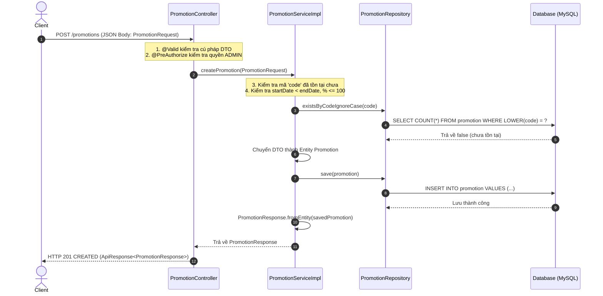
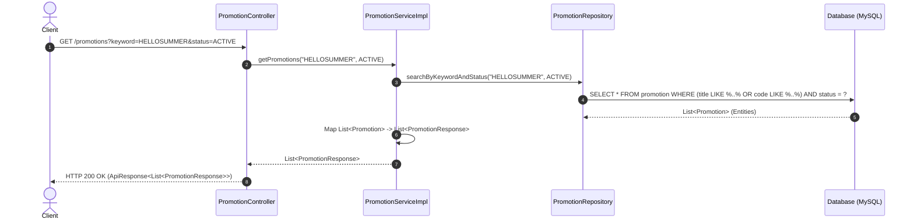
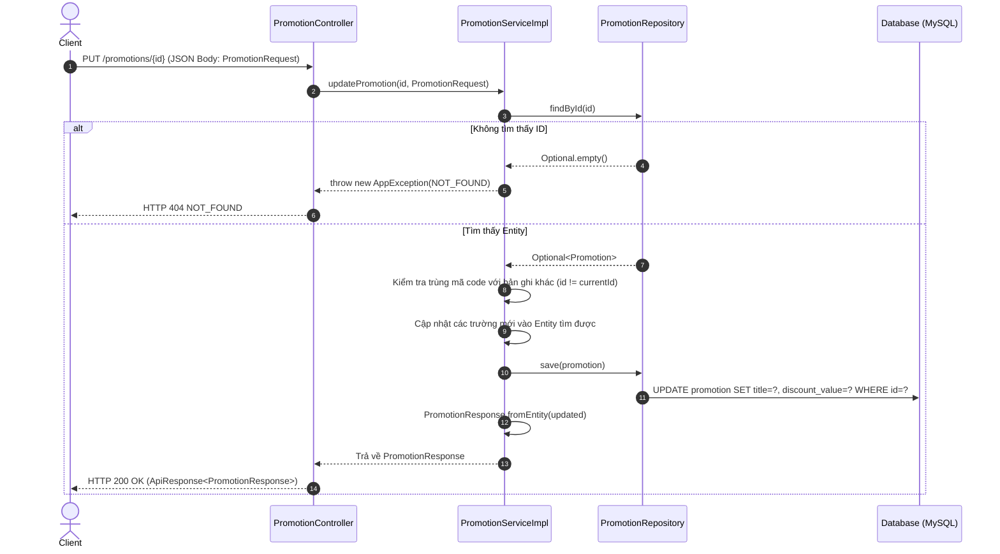
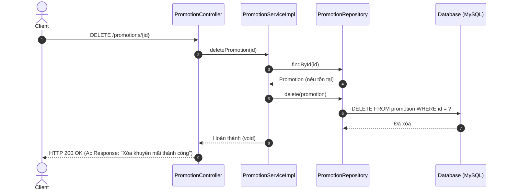

# 📚 HƯỚNG DẪN KIẾN TRÚC VÀ XÂY DỰNG BỘ API CRUD HOÀN CHỈNH (SPRING BOOT)

Tài liệu này giải thích chi tiết cấu trúc, luồng hoạt động và cách thức các tầng **liên kết với nhau** trong một bộ **API CRUD hoàn chỉnh** (Create - Read - Update - Delete). 

Toàn bộ ví dụ được **thống nhất xuyên suốt trên Module Quản Lý Khuyến Mãi (`Promotion`)** từ chính mã nguồn thực tế của dự án.

---

## 📑 Mục Lục
1. [Tổng quan kiến trúc phân tầng & Cơ chế liên kết](#1-tổng-quan-kiến-trúc-phân-tầng--cơ-chế-liên-kết)
2. [Bản đồ các file trong bộ API CRUD Khuyến Mãi (`Promotion`)](#2-bản-đồ-các-file-trong-bộ-api-crud-khuyến-mãi-promotion)
3. [Sơ đồ tuần tự các luồng CRUD (Sequence Diagrams)](#3-sơ-đồ-tuần-tự-các-luồng-crud-sequence-diagrams)
4. [Bóc tách chi tiết từng tầng & Cách thức liên kết](#4-bóc-tách-chi-tiết-từng-tầng--cách-thức-liên-kết)
   - [4.1. Tầng 1: Entity (Mô hình hóa dữ liệu CSDL)](#41-tầng-1-entity-mô-hình-hóa-dữ-liệu-csdl)
   - [4.2. Tầng 2: Repository (Tương tác Database)](#42-tầng-2-repository-tương-tác-database)
   - [4.3. Tầng 3: DTO & Mapper (Đóng gói và chuyển đổi dữ liệu)](#43-tầng-3-dto--mapper-đóng-gói-và-chuyển-đổi-dữ-liệu)
   - [4.4. Tầng 4: Service Layer (Xử lý nghiệp vụ & Transaction)](#44-tầng-4-service-layer-xử-lý-nghiệp-vụ--transaction)
   - [4.5. Tầng 5: Controller Layer (REST Endpoint & Routing)](#45-tầng-5-controller-layer-rest-endpoint--routing)
   - [4.6. Tầng 6: Global Exception Handler (Xử lý lỗi tập trung)](#46-tầng-6-global-exception-handler-xử-lý-lỗi-tập-trung)
5. [Bảng tổng hợp cách thức các tầng liên kết với nhau](#5-bảng-tổng-hợp-cách-thức-các-tầng-liên-kết-với-nhau)
6. [Quy trình 6 bước chuẩn để tạo mới một bộ API CRUD bất kỳ](#6-quy-trình-6-bước-chuẩn-để-tạo-mới-một-bộ-api-crud-bất-kỳ)

---

## 1. Tổng quan kiến trúc phân tầng & Cơ chế liên kết

Hệ thống hoạt động theo mô hình **3-Layer Architecture** (Controller - Service - Repository). Mỗi tầng có một nhiệm vụ độc lập và liên kết với nhau theo chiều dọc:

```
┌─────────────────────────────────────────────────────────────────────────────┐
│                           1. CLIENT (Frontend / Postman)                    │
└──────────────────────────────────────┬──────────────────────────────────────┘
                                       │ 🔗 [HTTP/JSON] Request qua URL, Headers, Body
                                       ▼
┌─────────────────────────────────────────────────────────────────────────────┐
│                           2. CONTROLLER LAYER                               │
│  - File: PromotionController.java                                           │
│  - Tiếp nhận HTTP Request, Validate (@Valid), Phân quyền (@PreAuthorize)    │
└──────────────────────────────────────┬──────────────────────────────────────┘
                                       │ 🔗 [Method Call] Gọi qua Interface PromotionService
                                       │    Truyền vào: Request DTO (PromotionRequest, UUID)
                                       │    Nhận về: Response DTO (PromotionResponse)
                                       ▼
┌─────────────────────────────────────────────────────────────────────────────┐
│                           3. SERVICE LAYER                                  │
│  - Interface: PromotionService.java                                         │
│  - Implementation: PromotionServiceImpl.java                                │
│  - Chứa Business Logic, Kiểm tra trùng mã, Validate ngày, Quản lý @Transactional│
└───────────────────┬─────────────────────────────────────▲───────────────────┘
                    │                                     │
                    │ 🔗 [Method Call] Gọi PromotionRepository
                    │    Truyền/Nhận: Entity Promotion    │ 🔗 [Mapper]
                    │                                     │    fromEntity()
                    ▼                                     │    Chuyển đổi Entity -> DTO
┌─────────────────────────────────────────────────────────┴───────────────────┐
│                           4. REPOSITORY LAYER                               │
│  - File: PromotionRepository.java                                           │
│  - Kế thừa JpaRepository<Promotion, UUID>, Custom JPQL Query                │
└──────────────────────────────────────┬──────────────────────────────────────┘
                                       │ 🔗 [ORM / JDBC] Hibernate tự sinh SQL & thực thi
                                       ▼
┌─────────────────────────────────────────────────────────────────────────────┐
│                           5. DATABASE (MySQL)                               │
│  - Bảng: promotion (ánh xạ từ Promotion.java)                               │
└─────────────────────────────────────────────────────────────────────────────┘
```

---

## 2. Bản đồ các file trong bộ API CRUD Khuyến Mãi (`Promotion`)

Bộ API CRUD cho tính năng Khuyến mãi được cấu thành từ 7 file chính sau:

| Tầng | Đường dẫn file | Vai trò |
| :--- | :--- | :--- |
| **Entity** | `server/.../entity/Promotion.java` | Ánh xạ trực tiếp với bảng `promotion` trong CSDL |
| **Repository** | `server/.../repository/PromotionRepository.java` | Thực hiện các câu lệnh SQL (INSERT, SELECT, UPDATE, DELETE) |
| **Request DTO** | `server/.../dto/request/PromotionRequest.java` | Nhận dữ liệu Client gửi lên khi Create / Update |
| **Response DTO**| `server/.../dto/response/PromotionResponse.java`| Đóng gói dữ liệu trả về cho Client kèm mapper `fromEntity()` |
| **Service Interface** | `server/.../service/PromotionService.java` | Định nghĩa hợp đồng (contract) các nghiệp vụ CRUD |
| **Service Impl** | `server/.../service/impl/PromotionServiceImpl.java` | Triển khai chi tiết logic nghiệp vụ, transaction, kiểm tra trùng lặp |
| **Controller** | `server/.../controller/PromotionController.java` | Mở các REST endpoint: GET, POST, PUT, DELETE |

---

## 3. Sơ đồ tuần tự các luồng CRUD (Sequence Diagrams)

### Luồng 1: [CREATE] Tạo mới khuyến mãi (`POST /promotions`)


---

### Luồng 2: [READ] Lấy danh sách khuyến mãi có bộ lọc (`GET /promotions?keyword=...&status=...`)


---

### Luồng 3: [UPDATE] Cập nhật khuyến mãi (`PUT /promotions/{id}`)


---

### Luồng 4: [DELETE] Xóa khuyến mãi (`DELETE /promotions/{id}`)


---

## 4. Bóc tách chi tiết từng tầng & Cách thức liên kết

---

### 4.1. Tầng 1: Entity (Mô hình hóa dữ liệu CSDL)
* **File**: `server/src/main/java/com/nhom_5/server/entity/Promotion.java`
* **Nhiệm vụ**: Ánh xạ bảng `promotion` trong Database vào đối tượng Java (Object-Relational Mapping - ORM).

```java
@Getter
@Setter
@SuperBuilder
@NoArgsConstructor
@AllArgsConstructor
@Entity
@Table(name = "promotion")
public class Promotion extends BaseEntity {

    @Column(name = "title", nullable = false)
    private String title;

    @Column(name = "description", columnDefinition = "TEXT")
    private String description;

    @Enumerated(EnumType.STRING)
    @Column(name = "discount_type", nullable = false)
    private DiscountType discountType; // PERCENT hoặc FIXED_AMOUNT

    @Column(name = "discount_value", nullable = false, precision = 12, scale = 2)
    private BigDecimal discountValue;

    @Column(name = "start_date", nullable = false)
    private Instant startDate;

    @Column(name = "end_date", nullable = false)
    private Instant endDate;

    @Enumerated(EnumType.STRING)
    @Builder.Default
    @Column(name = "status", nullable = false)
    private PromotionStatus status = PromotionStatus.ACTIVE;

    @Column(name = "code", nullable = false, unique = true)
    private String code;
}
```

#### 🔗 Điểm liên kết:
* **Liên kết với Database**: Thông qua `@Table(name = "promotion")` và các `@Column`. Kế thừa `BaseEntity` để lấy `id` (UUID), `createdAt`, `updatedAt`.
* **Cung cấp cho Repository & Service**: Là đơn vị dữ liệu cốt lõi mà Repository truy vấn ra và Service thao tác logic.

---

### 4.2. Tầng 2: Repository (Tương tác Database)
* **File**: `server/src/main/java/com/nhom_5/server/repository/PromotionRepository.java`
* **Nhiệm vụ**: Cung cấp các phương thức truy xuất dữ liệu từ bảng `promotion`.

```java
@Repository
public interface PromotionRepository extends JpaRepository<Promotion, UUID> {
    
    // 1. Tìm theo mã code chính xác (không phân biệt hoa thường)
    Optional<Promotion> findByCodeIgnoreCase(String code);

    // 2. Kiểm tra mã code đã tồn tại khi tạo mới (CREATE)
    boolean existsByCodeIgnoreCase(String code);

    // 3. Kiểm tra mã code trùng nhưng loại trừ chính ID đang sửa (UPDATE)
    boolean existsByCodeIgnoreCaseAndIdNot(String code, UUID id);

    // 4. Tìm kiếm có bộ lọc keyword & status kết hợp sắp xếp ngày mới nhất
    @Query("""
            SELECT p
            FROM Promotion p
            WHERE (LOWER(p.title) LIKE LOWER(CONCAT('%', :keyword, '%'))
                OR LOWER(p.code) LIKE LOWER(CONCAT('%', :keyword, '%')))
              AND p.status = :status
            ORDER BY p.startDate DESC, p.createdAt DESC
            """)
    List<Promotion> searchByKeywordAndStatus(@Param("keyword") String keyword, @Param("status") PromotionStatus status);

    // 5. Lấy toàn bộ sắp xếp mặc định
    List<Promotion> findAllByOrderByStartDateDescCreatedAtDesc();
}
```

#### 🔗 Điểm liên kết:
* **Liên kết với Entity**: Kế thừa `JpaRepository<Promotion, UUID>`, nhận Entity `Promotion` và kiểu khóa chính `UUID`.
* **Liên kết với CSDL**: Hibernate tự động dịch các method thành các câu lệnh SQL Native (`SELECT`, `INSERT`, `UPDATE`, `DELETE`, `COUNT`).
* **Liên kết với Service**: Được `PromotionServiceImpl` tiêm vào (Inject) qua constructor để gọi khi cần đọc/ghi dữ liệu.

---

### 4.3. Tầng 3: DTO & Mapper (Đóng gói và chuyển đổi dữ liệu)

#### 1. Request DTO (`PromotionRequest.java`): Nhận dữ liệu từ Client
```java
@Getter
@Setter
@Builder
@NoArgsConstructor
@AllArgsConstructor
@Schema(description = "Dữ liệu tạo hoặc cập nhật khuyến mãi")
public class PromotionRequest {

    @NotBlank(message = "Tiêu đề khuyến mãi không được để trống")
    @Size(max = 255, message = "Tiêu đề khuyến mãi không vượt quá 255 ký tự")
    private String title;

    private String description;

    @NotNull(message = "Loại giảm giá không được để trống")
    private DiscountType discountType;

    @NotNull(message = "Giá trị giảm giá không được để trống")
    @DecimalMin(value = "0.01", message = "Giá trị giảm giá phải lớn hơn 0")
    private BigDecimal discountValue;

    @NotNull(message = "Ngày bắt đầu không được để trống")
    private Instant startDate;

    @NotNull(message = "Ngày kết thúc không được để trống")
    private Instant endDate;

    @NotNull(message = "Trạng thái khuyến mãi không được để trống")
    private PromotionStatus status;

    @NotBlank(message = "Mã khuyến mãi không được để trống")
    @Size(max = 100, message = "Mã khuyến mãi không vượt quá 100 ký tự")
    private String code;
}
```

#### 2. Response DTO (`PromotionResponse.java`): Trả dữ liệu về Client kèm Mapper `fromEntity`
```java
@Getter
@Setter
@Builder
@NoArgsConstructor
@AllArgsConstructor
@Schema(description = "Thông tin khuyến mãi")
public class PromotionResponse {

    private UUID id;
    private String title;
    private String description;
    private DiscountType discountType;
    private BigDecimal discountValue;
    private Instant startDate;
    private Instant endDate;
    private PromotionStatus status;
    private String code;
    private Instant createdAt;
    private Instant updatedAt;

    // 🔗 CẦU NỐI CHUYỂN ĐỔI: Entity -> DTO
    public static PromotionResponse fromEntity(Promotion promotion) {
        if (promotion == null) return null;
        return PromotionResponse.builder()
                .id(promotion.getId())
                .title(promotion.getTitle())
                .description(promotion.getDescription())
                .discountType(promotion.getDiscountType())
                .discountValue(promotion.getDiscountValue())
                .startDate(promotion.getStartDate())
                .endDate(promotion.getEndDate())
                .status(promotion.getStatus())
                .code(promotion.getCode())
                .createdAt(promotion.getCreatedAt())
                .updatedAt(promotion.getUpdatedAt())
                .build();
    }
}
```

#### 🔗 Điểm liên kết:
* **Tại sao không trả trực tiếp `Promotion` Entity về cho Client?**
  * Ngăn chặn rò rỉ dữ liệu nhạy cảm hoặc cấu trúc bảng CSDL nội bộ.
  * Tránh lỗi vòng lặp tuần hoàn vô tận (Infinite Recursion) khi Entity có các quan hệ 2 chiều (`@OneToMany`, `@ManyToOne`) khi Jackson serialize sang JSON.

---

### 4.4. Tầng 4: Service Layer (Xử lý nghiệp vụ & Transaction)

#### 1. Interface (`PromotionService.java`): Định nghĩa hợp đồng nghiệp vụ
```java
public interface PromotionService {
    List<PromotionResponse> getPromotions(String keyword, PromotionStatus status);
    PromotionResponse getPromotionById(UUID id);
    PromotionResponse validateCode(String code);
    PromotionResponse createPromotion(PromotionRequest request);
    PromotionResponse updatePromotion(UUID id, PromotionRequest request);
    void deletePromotion(UUID id);
}
```

#### 2. Class Triển khai (`PromotionServiceImpl.java`): Nơi hội tụ logic của toàn bộ tầng
```java
@Service
@RequiredArgsConstructor
public class PromotionServiceImpl implements PromotionService {

    private static final BigDecimal MAX_PERCENT_DISCOUNT = BigDecimal.valueOf(100);
    
    // 🔗 LIÊN KẾT VỚI REPOSITORY: Inject thông qua @RequiredArgsConstructor của Lombok
    private final PromotionRepository promotionRepository;

    // --- 1. [READ] Lấy danh sách khuyến mãi có lọc ---
    @Override
    @Transactional(readOnly = true)
    public List<PromotionResponse> getPromotions(String keyword, PromotionStatus status) {
        String normalizedKeyword = StringUtils.hasText(keyword) ? keyword.trim() : null;
        List<Promotion> promotions;
        
        if (normalizedKeyword != null && status != null) {
            promotions = promotionRepository.searchByKeywordAndStatus(normalizedKeyword, status);
        } else if (status != null) {
            promotions = promotionRepository.findByStatusOrderByStartDateDescCreatedAtDesc(status);
        } else {
            promotions = promotionRepository.findAllByOrderByStartDateDescCreatedAtDesc();
        }

        // Chuyển đổi danh sách Entity sang danh sách DTO để trả về
        return promotions.stream()
                .map(PromotionResponse::fromEntity)
                .toList();
    }

    // --- 2. [READ] Lấy chi tiết khuyến mãi theo ID ---
    @Override
    @Transactional(readOnly = true)
    public PromotionResponse getPromotionById(UUID id) {
        return PromotionResponse.fromEntity(findPromotion(id));
    }

    // --- 3. [CREATE] Tạo mới khuyến mãi ---
    @Override
    @Transactional
    public PromotionResponse createPromotion(PromotionRequest request) {
        // Validate nghiệp vụ (Check trùng code, check ngày)
        validateRequest(request, null);

        // Chuyển DTO -> Entity và lưu vào CSDL
        Promotion promotion = Promotion.builder().build();
        applyRequest(promotion, request);
        
        Promotion saved = promotionRepository.save(promotion);
        return PromotionResponse.fromEntity(saved);
    }

    // --- 4. [UPDATE] Cập nhật khuyến mãi ---
    @Override
    @Transactional
    public PromotionResponse updatePromotion(UUID id, PromotionRequest request) {
        Promotion promotion = findPromotion(id); // Kiểm tra tồn tại
        validateRequest(request, id);            // Check trùng code với bản ghi khác
        applyRequest(promotion, request);        // Cập nhật giá trị mới

        Promotion updated = promotionRepository.save(promotion);
        return PromotionResponse.fromEntity(updated);
    }

    // --- 5. [DELETE] Xóa khuyến mãi ---
    @Override
    @Transactional
    public void deletePromotion(UUID id) {
        Promotion promotion = findPromotion(id);
        promotionRepository.delete(promotion);
    }

    // ================= HELPER METHODS (Xử lý nội bộ) =================

    private Promotion findPromotion(UUID id) {
        return promotionRepository.findById(id)
                .orElseThrow(() -> new AppException(ErrorCode.NOT_FOUND, "Không tìm thấy khuyến mãi với ID: " + id));
    }

    private void validateRequest(PromotionRequest request, UUID currentId) {
        // 1. Kiểm tra ngày hợp lệ: startDate phải trước endDate
        if (request.getStartDate().isAfter(request.getEndDate())) {
            throw new AppException(ErrorCode.BAD_REQUEST, "Ngày bắt đầu phải trước ngày kết thúc");
        }
        // 2. Nếu giảm % thì giá trị không được vượt quá 100%
        if (request.getDiscountType() == DiscountType.PERCENT && request.getDiscountValue().compareTo(MAX_PERCENT_DISCOUNT) > 0) {
            throw new AppException(ErrorCode.BAD_REQUEST, "Giá trị giảm theo phần trăm không được vượt quá 100%");
        }
        // 3. Kiểm tra trùng lặp mã code
        String code = request.getCode().trim();
        boolean codeExists = (currentId == null) 
                ? promotionRepository.existsByCodeIgnoreCase(code)
                : promotionRepository.existsByCodeIgnoreCaseAndIdNot(code, currentId);

        if (codeExists) {
            throw new AppException(ErrorCode.BAD_REQUEST, "Mã khuyến mãi đã tồn tại: " + code);
        }
    }

    private void applyRequest(Promotion promotion, PromotionRequest request) {
        promotion.setTitle(request.getTitle().trim());
        promotion.setDescription(request.getDescription());
        promotion.setDiscountType(request.getDiscountType());
        promotion.setDiscountValue(request.getDiscountValue());
        promotion.setStartDate(request.getStartDate());
        promotion.setEndDate(request.getEndDate());
        promotion.setStatus(request.getStatus());
        promotion.setCode(request.getCode().trim().toUpperCase());
    }
}
```

#### 🔗 Điểm liên kết:
* **Liên kết với Controller**: Triển khai `PromotionService` interface để Controller gọi tới.
* **Liên kết với Repository**: Gọi các hàm của `PromotionRepository` để truy vấn/lưu Entity.
* **Liên kết với DTO**: Sử dụng `PromotionResponse.fromEntity(...)` để chuyển đổi Entity sang DTO an toàn.
* **Liên kết với Exception Handler**: Chủ động ném `throw new AppException(ErrorCode.BAD_REQUEST, "...")` khi vi phạm quy tắc nghiệp vụ.

---

### 4.5. Tầng 5: Controller Layer (REST Endpoint & Routing)
* **File**: `server/src/main/java/com/nhom_5/server/controller/PromotionController.java`
* **Nhiệm vụ**: Cung cấp giao diện HTTP RESTful API ra bên ngoài cho Frontend/Mobile gọi tới.

```java
@Tag(name = "12. Khuyến mãi (Promotions)", description = "Các API tra cứu mã giảm giá và quản trị khuyến mãi")
@RestController
@RequestMapping("/promotions")
@RequiredArgsConstructor
public class PromotionController {

    // 🔗 LIÊN KẾT VỚI SERVICE: Tiêm Interface PromotionService qua Constructor Injection
    private final PromotionService promotionService;

    // --- 1. [READ ALL] GET /promotions?keyword=...&status=... ---
    @Operation(summary = "[PUBLIC] Lấy danh sách chương trình khuyến mãi")
    @GetMapping
    public ResponseEntity<ApiResponse<List<PromotionResponse>>> getPromotions(
            @RequestParam(required = false) String keyword,
            @RequestParam(required = false) PromotionStatus status
    ) {
        List<PromotionResponse> data = promotionService.getPromotions(keyword, status);
        return ResponseEntity.ok(ApiResponse.success("Lấy danh sách khuyến mãi thành công", data));
    }

    // --- 2. [READ ONE] GET /promotions/{id} ---
    @Operation(summary = "[PUBLIC] Lấy chi tiết khuyến mãi theo ID")
    @GetMapping("/{id}")
    public ResponseEntity<ApiResponse<PromotionResponse>> getPromotionById(@PathVariable UUID id) {
        PromotionResponse data = promotionService.getPromotionById(id);
        return ResponseEntity.ok(ApiResponse.success("Lấy thông tin khuyến mãi thành công", data));
    }

    // --- 3. [CREATE] POST /promotions ---
    @Operation(summary = "[ADMIN] Tạo chương trình khuyến mãi mới", security = {@SecurityRequirement(name = "bearerAuth")})
    @PreAuthorize("hasRole('ADMIN')")
    @PostMapping
    public ResponseEntity<ApiResponse<PromotionResponse>> createPromotion(@Valid @RequestBody PromotionRequest request) {
        PromotionResponse created = promotionService.createPromotion(request);
        return ResponseEntity
                .status(HttpStatus.CREATED)
                .body(ApiResponse.success(201, "Tạo khuyến mãi mới thành công", created));
    }

    // --- 4. [UPDATE] PUT /promotions/{id} ---
    @Operation(summary = "[ADMIN] Cập nhật chương trình khuyến mãi", security = {@SecurityRequirement(name = "bearerAuth")})
    @PreAuthorize("hasRole('ADMIN')")
    @PutMapping("/{id}")
    public ResponseEntity<ApiResponse<PromotionResponse>> updatePromotion(
            @PathVariable UUID id,
            @Valid @RequestBody PromotionRequest request
    ) {
        PromotionResponse updated = promotionService.updatePromotion(id, request);
        return ResponseEntity.ok(ApiResponse.success("Cập nhật khuyến mãi thành công", updated));
    }

    // --- 5. [DELETE] DELETE /promotions/{id} ---
    @Operation(summary = "[ADMIN] Xóa chương trình khuyến mãi", security = {@SecurityRequirement(name = "bearerAuth")})
    @PreAuthorize("hasRole('ADMIN')")
    @DeleteMapping("/{id}")
    public ResponseEntity<ApiResponse<Void>> deletePromotion(@PathVariable UUID id) {
        promotionService.deletePromotion(id);
        return ResponseEntity.ok(ApiResponse.success("Xóa khuyến mãi thành công", null));
    }
}
```

#### 🔗 Điểm liên kết:
* **Liên kết với Client**: 
  - Khai báo Path qua `@RequestMapping("/promotions")`.
  - Nhận HTTP Body qua `@RequestBody PromotionRequest request`.
  - Nhận Path Param qua `@PathVariable UUID id`.
  - Nhận Query Param qua `@RequestParam String keyword`.
* **Liên kết với Validation**: `@Valid` kích hoạt kiểm tra các ràng buộc (`@NotBlank`, `@NotNull`, `@DecimalMin`) trên `PromotionRequest`. Nếu sai cú pháp, lập tức chặn lại và ném `MethodArgumentNotValidException`.
* **Liên kết với Service**: Gọi trực tiếp `promotionService.createPromotion(request)` mà không can thiệp vào cách Service lưu CSDL ra sao.
* **Liên kết với Response Wrapper**: Đóng gói kết quả trong `ApiResponse.success(...)` và bọc trong `ResponseEntity` để thiết lập HTTP Status Code (200 OK, 201 CREATED).

---

### 4.6. Tầng 6: Global Exception Handler (Xử lý lỗi tập trung)
* **File**: `server/src/main/java/com/nhom_5/server/exception/GlobalExceptionHandler.java`

```java
@RestControllerAdvice
public class GlobalExceptionHandler {

    // Bắt các lỗi nghiệp vụ do Service ném ra (VD: NOT_FOUND, BAD_REQUEST)
    @ExceptionHandler(AppException.class)
    public ResponseEntity<ApiResponse<Object>> handleAppException(AppException ex) {
        ErrorCode errorCode = ex.getErrorCode();
        return ResponseEntity
                .status(errorCode.getStatusCode())
                .body(ApiResponse.error(errorCode.getCode(), ex.getMessage() != null ? ex.getMessage() : errorCode.getMessage()));
    }

    // Bắt lỗi Validation khi Request DTO không thỏa mãn @Valid
    @ExceptionHandler(MethodArgumentNotValidException.class)
    public ResponseEntity<ApiResponse<Object>> handleValidationException(MethodArgumentNotValidException ex) {
        List<FieldErrorDto> errors = ex.getBindingResult().getFieldErrors().stream()
                .map(err -> new FieldErrorDto(err.getField(), err.getDefaultMessage()))
                .toList();
        return ResponseEntity
                .badRequest()
                .body(ApiResponse.error(400, "Dữ liệu không hợp lệ", errors));
    }
}
```

---

## 5. Bảng tổng hợp cách thức các tầng liên kết với nhau

| 2 Tầng liên kết | Cơ chế liên kết kỹ thuật | Dữ liệu truyền đi | Dữ liệu nhận về |
| :--- | :--- | :--- | :--- |
| **Client $\leftrightarrow$ Controller** | **HTTP Protocol** (JSON / REST API qua DispatcherServlet & Jackson) | HTTP Request (Headers, URL, Query Params, JSON Body) | HTTP Response (Status Code + `ApiResponse<T>` JSON) |
| **Controller $\leftrightarrow$ Service** | **Java Method Invocation** (Inject qua Constructor `@RequiredArgsConstructor`) | DTO (`PromotionRequest`), Tham số cơ bản (`UUID id`, `String code`) | DTO (`PromotionResponse`, `List<PromotionResponse>`) |
| **Service $\leftrightarrow$ Repository** | **Spring Data JPA Interface Invocation** (Inject `PromotionRepository`) | Entity (`Promotion`), ID (`UUID`), Query Params | Entity (`Promotion`), `Optional<Promotion>`, `List<Promotion>` |
| **Service $\leftrightarrow$ DTO Mapper** | **Static Method Call** (`PromotionResponse.fromEntity(entity)`) | Entity (`Promotion`) | DTO (`PromotionResponse`) |
| **Repository $\leftrightarrow$ Database** | **ORM & JDBC Driver** (Hibernate sinh câu lệnh SQL tương tác qua MySQL Connection Pool) | SQL Statements (`INSERT`, `SELECT`, `UPDATE`, `DELETE`) | JDBC ResultSet (được Hibernate map ngược thành Entity) |
| **Service/Controller $\leftrightarrow$ Exception Handler** | **Spring AOP Exception Interception** (`@RestControllerAdvice` + `@ExceptionHandler`) | Exception bị `throw` (`AppException`, `MethodArgumentNotValidException`) | `ResponseEntity<ApiResponse<Object>>` chuẩn hóa |

---

## 6. Quy trình 6 bước chuẩn để tạo mới một bộ API CRUD bất kỳ

Khi muốn tạo mới một bộ API CRUD cho bất kỳ đối tượng nào (ví dụ: `News`, `Room`, `FoodCombo`...), bạn chỉ cần thực hiện theo đúng trình tự sau:

```
[1. Entity] ──> [2. Repository] ──> [3. DTOs] ──> [4. Service] ──> [5. Controller] ──> [6. Exception/Test]
```

1. **Bước 1 (Entity)**: Tạo class Entity kế thừa `BaseEntity`, đánh dấu `@Entity`, `@Table(name = "...")` và các trường thuộc tính.
2. **Bước 2 (Repository)**: Tạo Interface trong `repository/` kế thừa `JpaRepository<Entity, UUID>`, thêm các method query đặc thù (`findBy...`, `existsBy...`, `@Query`).
3. **Bước 3 (DTOs)**:
   - Tạo `XxxRequest.java` với các annotation validation (`@NotBlank`, `@NotNull`).
   - Tạo `XxxResponse.java` kèm hàm static `fromEntity(Xxx entity)`.
4. **Bước 4 (Service)**:
   - Khai báo các hàm CRUD trong interface `XxxService.java`.
   - Viết logic triển khai trong `XxxServiceImpl.java`, đánh dấu `@Service`, `@Transactional`, kiểm tra điều kiện nghiệp vụ và mapping DTO $\leftrightarrow$ Entity.
5. **Bước 5 (Controller)**: Tạo `XxxController.java`, gán `@RestController`, `@RequestMapping("/xxx")`, mở 5 endpoint chuẩn (`GET /`, `GET /{id}`, `POST /`, `PUT /{id}`, `DELETE /{id}`), thêm `@Valid` và `@PreAuthorize`.
6. **Bước 6 (Exception & Kiểm thử)**: Đăng ký các mã lỗi mới trong `ErrorCode.java` (nếu cần) và kiểm tra API qua Swagger UI (`http://localhost:8080/api/v1/swagger-ui.html`).
